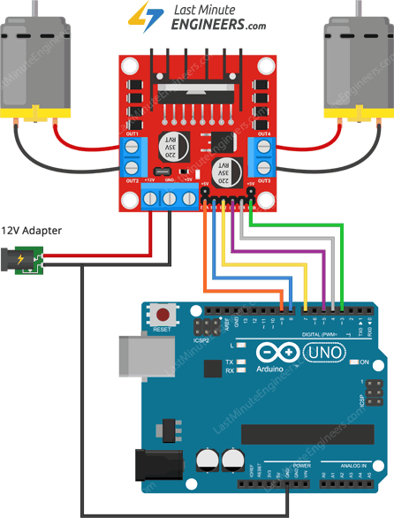

# 16.57 - Robótica Bioinspirada - Segundo Cuat. 2023

## Authors

* [Julián Arce](github.com/JuArce)
* [Roberto Catalán](github.com/rcatalan98)
* [Uriel Mihura](github.com/uri-99)
* [Gian Luca Pecile](github.com/glpecile)

## Code

Inspired by: https://lastminuteengineers.com/l298n-dc-stepper-driver-arduino-tutorial

### Wiring

